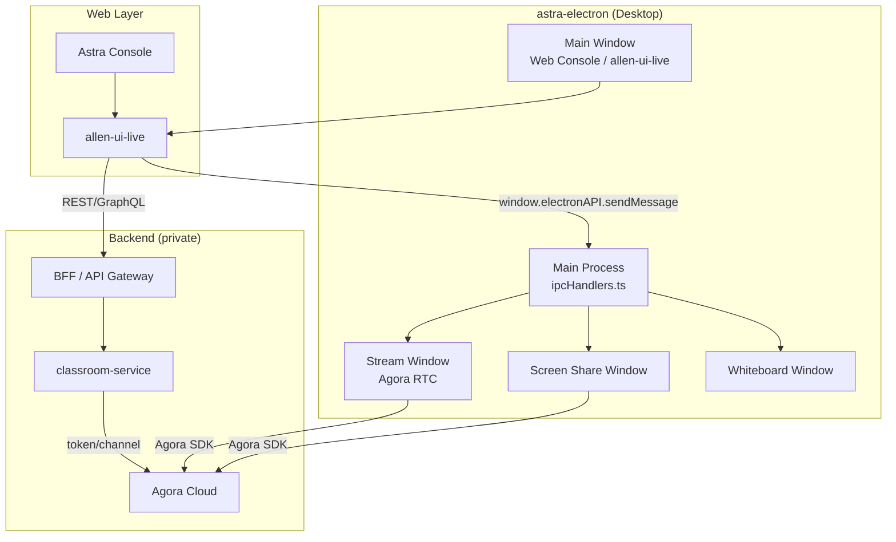
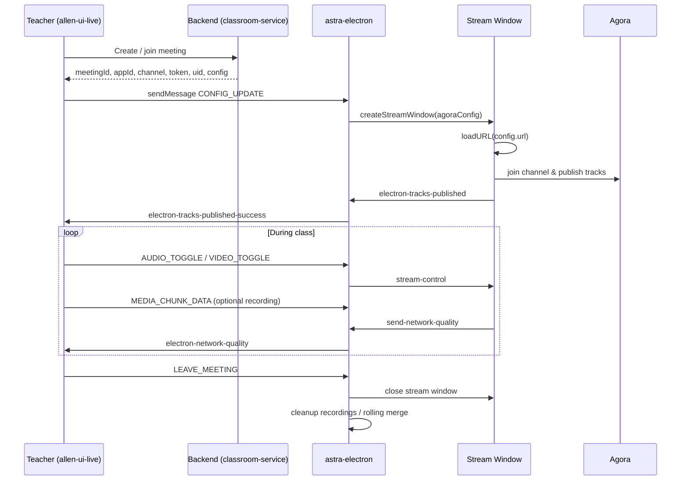
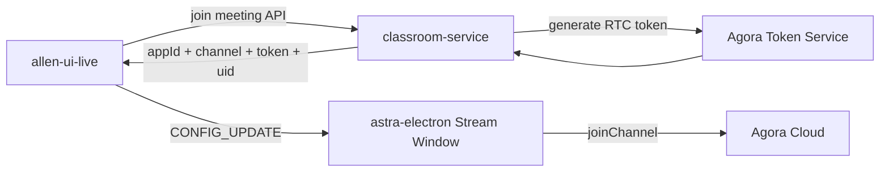

# Onboarding: Allen UI Live, Astra Console & Backend Integration

> **Audience:** Engineers joining the Allen Digital live-class / teacher-console stack.
>
> **Last updated:** 2026-08-24
>
> **Source of truth in this doc:**
> - ✅ Verified from `astra-electron` source code (this repo)
> - ⚠️ Inferred from Allen ecosystem patterns (private repos not accessible in this environment)
> - 🔲 Needs confirmation once `allen-ui-live` / `classroom-service` access is granted

---

## Table of Contents

1. [System Overview](#1-system-overview)
2. [Repositories & Responsibilities](#2-repositories--responsibilities)
3. [Environments & URLs](#3-environments--urls)
4. [End-to-End Architecture](#4-end-to-end-architecture)
5. [Meeting Lifecycle](#5-meeting-lifecycle)
6. [allen-ui-live ↔ astra-electron Contract](#6-allen-ui-live--astra-electron-contract)
7. [Agora / RTC Integration](#7-agora--rtc-integration)
8. [Backend Services (Inferred)](#8-backend-services-inferred)
9. [Local Development Setup](#9-local-development-setup)
10. [Deployment & CI/CD](#10-deployment--cicd)
11. [Debugging & Operations](#11-debugging--operations)
12. [Appendix: IPC & Event Reference](#12-appendix-ipc--event-reference)

---

## 1. System Overview

Allen Digital's **live teacher experience** is a multi-layer system:

| Layer | Component | Role |
|-------|-----------|------|
| **Desktop shell** | `astra-electron` | Native Electron wrapper; loads the web console; owns Agora RTC windows, screen share, whiteboard, recording, auto-update |
| **Web UI (teacher)** | `allen-ui-live` ⚠️ | Teacher-facing live-class UI rendered inside Electron's main window (and stream sub-windows) |
| **Web console shell** | Astra Console (`astra.allen.in`) | Broader teacher console; entry point for navigation, auth, and routing into live class |
| **Backend** | `classroom-service` ⚠️ + others | gRPC/REST microservices for meeting orchestration, tokens, roster, class metadata |
| **RTC provider** | Agora | Real-time audio/video channels, screen capture, network quality |

### Mental model

```
Teacher opens Astra Electron
        │
        ▼
Main window loads web console URL (stage/prod/custom)
        │
        ▼
Web app (allen-ui-live) detects window.electronAPI.isElectron
        │
        ├── REST/gRPC → classroom-service (meeting create/join, Agora token)
        │
        └── IPC → astra-electron (native RTC windows, recording, screen share)
```

**Key insight:** The web UI does **not** talk to Agora directly for the primary teacher stream in Electron. It asks `astra-electron` to open a dedicated **Stream Window** that loads a URL (from backend config) and runs Agora natively via `agora-electron-sdk`.

---

## 2. Repositories & Responsibilities

### ✅ `astra-electron` (this repo)

| Item | Detail |
|------|--------|
| GitHub | `Allen-Career-Institute/astra-electron` |
| Package name | `astra-electron` v1.0.16 |
| Stack | Electron 23, TypeScript, React (native windows only), Webpack, Agora Electron SDK 4.5.2 |
| Entry point | `src/main.ts` → compiled to `dist/main.js` |

**What it owns:**
- Main `BrowserWindow` hosting the web console
- Stream window (Agora publish/subscribe)
- Screen share window (Agora screen capture)
- Whiteboard window
- Local recording chunk storage & merge (`rollingMergeManager`)
- Auto-update via GitHub Releases (`electron-updater`)
- Sentry crash/error reporting
- macOS/Windows media permissions

**What it does NOT own:**
- Business logic for class scheduling, roster, attendance
- Agora token generation (comes from backend via web UI payload)
- Teacher authentication UI (handled by web console + JumpCloud SSO)

---

### ⚠️ `allen-ui-live` (private — not accessible here)

Referenced explicitly in `src/utils/ipcHandlers.ts`:

```ts
// Centralized IPC Communication handler for allen-ui-live web app
```

| Item | Detail |
|------|--------|
| Role | Teacher live-class React/web application |
| Runs in | Electron main window (`window.electronAPI`) and stream sub-window URLs |
| Detects Electron via | `window.electronAPI?.isElectron === true` |
| Backend calls | REST/BFF to classroom and related services |
| Native calls | `window.electronAPI.sendMessage({ type, payload })` |

**URL hints from `astra-electron`:**
- Live class routes contain `liveclass` or `teacher-liveclass` (used for metrics gating and deferred auto-update)
- Production console: `https://astra.allen.in/`
- Stage console: `https://console.allen-stage.in/`

🔲 **Action for onboarding:** Clone `allen-ui-live`, find the Electron bridge module (search for `electronAPI`, `sendMessage`, `CONFIG_UPDATE`).

---

### ⚠️ `classroom-service` (private — not accessible here)

| Item | Detail |
|------|--------|
| Role | Backend microservice for live classroom / meeting orchestration |
| Expected stack | Go + Kratos v2, gRPC + HTTP, protobuf from `common-protos` |
| Pattern reference | `Allen-Career-Institute/collectionview-service` (public sibling service) |

**Likely responsibilities (inferred):**
- Create / join / end meeting
- Issue Agora RTC tokens (`appId`, `channel`, `token`, `uid`)
- Persist meeting metadata (`meetingId`)
- Expose configuration consumed by `allen-ui-live` (device defaults, dual-stream flags, whiteboard URL)
- Coordinate with other services (user, content, recording pipeline)

🔲 **Action for onboarding:** Request repo access; read `openapi.yaml`, `internal/service/`, and `common-protos/classroom/v1`.

---

### Related private repos (Allen ecosystem)

| Repo | Likely role |
|------|-------------|
| `common-protos` | Shared gRPC/HTTP API definitions |
| `go-kratos-commons` | Shared Kratos middleware, health, utilities |
| `go-bff-commons` | BFF layer between web UI and microservices |
| BFF / API Gateway | Routes browser calls to `classroom-service` |

---

## 3. Environments & URLs

### Web console URLs (✅ verified)

| Environment | URL | Used when |
|-------------|-----|-----------|
| **Production** | `https://astra.allen.in/` | `ENV=production` |
| **Stage** | `https://console.allen-stage.in/` | `ENV=stage` |
| **Development** | `CUSTOM_URL` (e.g. `http://localhost:3000`) | `ENV=development` |

Configured via `.env.local` and loaded in `src/modules/loadEnv.ts`.

### Electron environment file (`.env.local`)

```env
APP_VERSION=1.0.16
ENV=development          # development | stage | production
NODE_ENV=development

# Console URLs
STAGE_URL=https://console.allen-stage.in
PROD_URL=https://astra.allen.in
CUSTOM_URL=http://localhost:3000   # or local allen-ui-live dev server

# Dev auth (injected into localStorage in development)
AUTH_TOKEN={"AUTH_TOKEN":"...","API_TOKEN":"..."}

# Observability
ASTRA_ELECTRON_SENTRY_DSN=...
ASTRA_ELECTRON_SENTRY_ENDPOINT=...
```

### Route patterns (✅ verified in code)

| Pattern | Where used |
|---------|------------|
| `liveclass` | Auto-update deferred while teacher is in live class |
| `teacher-liveclass` | Process metrics forwarded to main window |

---

## 4. End-to-End Architecture



### Process & session model (✅ verified)

| Window | Process title | Preload script | Session |
|--------|---------------|----------------|---------|
| Main | `Astra-Main` | `dist/preload.js` | `persist:shared` |
| Stream | `Astra-Stream` | `dist/stream-preload.js` | `persist:shared` |
| Screen share | (registered via process naming) | `dist/screen-share-preload.js` | `persist:shared` |
| Whiteboard | (registered via process naming) | `dist/whiteboard-preload.js` | `persist:shared` |

All windows share `persist:shared` so cookies and `localStorage` (including auth tokens) are consistent.

---

## 5. Meeting Lifecycle

### High-level flow



### Lifecycle stages

| Stage | Owner | What happens |
|-------|-------|--------------|
| **1. Auth** | Web console | Teacher logs in (JumpCloud SSO); tokens stored in `localStorage` |
| **2. Navigate to live class** | allen-ui-live | Route matches `teacher-liveclass` / `liveclass` |
| **3. Meeting provision** | classroom-service ⚠️ | Returns Agora credentials + `meetingId` + stream URL |
| **4. Native stream start** | astra-electron | `CONFIG_UPDATE` opens stream window |
| **5. In-class controls** | allen-ui-live → electron | Mute/unmute, device change, screen share, whiteboard |
| **6. Recording (optional)** | astra-electron | WebM chunks saved under `userData/recordings/{meetingId}/` |
| **7. Leave** | allen-ui-live → electron | `LEAVE_MEETING` tears down windows; may trigger pending app update |
| **8. Logout** | allen-ui-live → electron | `app-logout` → JumpCloud logout window |

---

## 6. allen-ui-live ↔ astra-electron Contract

### Detection

```ts
const isElectron = typeof window !== 'undefined' && window.electronAPI?.isElectron === true;
```

### Primary API: `window.electronAPI.sendMessage`

All messages follow:

```ts
{ type: string, payload?: object }
// Response: { type: 'SUCCESS' | 'ERROR', payload?: any, error?: string }
```

### Message types (✅ verified from `ipcHandlers.ts`)

| Type | Direction | Purpose | Key payload fields |
|------|-----------|---------|-------------------|
| `CONFIG_UPDATE` | Web → Electron | Start/join Agora stream window | `appId`, `channel`, `token`, `uid`, `meetingId`, `deviceIds`, `isAudioEnabled`, `isVideoEnabled`, `hosts`, `url`, `configuration`, `is_dual_stream_enabled` |
| `AUDIO_TOGGLE` | Web → Electron | Mute/unmute mic | `enabled: boolean` |
| `VIDEO_TOGGLE` | Web → Electron | Mute/unmute camera | `enabled: boolean` |
| `CHANGE_AUDIO_DEVICE` | Web → Electron | Switch mic | `deviceId` |
| `CHANGE_VIDEO_DEVICE` | Web → Electron | Switch camera | `deviceId` |
| `START_SCREEN_SHARE` | Web → Electron | Open screen share window | `meetingId`, `app_id`, `user_id`, `user_token`, `isWhiteboard`, `agoraConfig` |
| `STOP_SCREEN_SHARE` | Web → Electron | Close screen share | — |
| `OPEN_WHITEBOARD` | Web → Electron | Open whiteboard window | `url`, `meetingId`, `features?` |
| `CLOSE_WHITEBOARD` | Web → Electron | Close whiteboard | — |
| `MEDIA_CHUNK_DATA` | Web → Electron | Save recording chunk | `meetingId`, `chunkData`, `chunkIndex`, `timestamp`, `isLastChunk`, `doRecording` |
| `NETWORK_QUALITY` | Web → Electron | Forward uplink/downlink stats | `uplinkNetworkQuality`, `downlinkNetworkQuality` |
| `LEAVE_MEETING` | Web → Electron | End session, cleanup | `meetingId?` |

### Additional `window.electronAPI` methods (✅ verified from `preload.ts`)

| Method | Purpose |
|--------|---------|
| `requestStreamConfig()` | Get current stream window Agora config |
| `sendMediaChunk()` | Recording via invoke path |
| `sendMediaChunkV2()` | Zero-copy recording via `postMessage` |
| `getDesktopSources(options)` | List screens/windows for screen share picker |
| `logout()` | Trigger JumpCloud logout flow |
| `getAppVersion()` | App version string |
| `writeImageToClipboard(dataUrl)` | Copy image to clipboard |
| `onElectronNetworkQuality(cb)` | Listen for `electron-network-quality` events |
| `onElectronTracksPublishedSuccess(cb)` | Stream tracks published |
| `onElectronScreenShareWindowOpened(cb)` | Screen share UI opened |
| `onElectronScreenShareWindowClosed(cb)` | Screen share UI closed |
| `onElectronLogEvent(cb)` | Analytics/log events from native windows |
| `onMetrics(cb)` | CPU/network metrics (when on `teacher-liveclass` route) |
| `onStreamControl(cb)` | Stream window control events |
| `onCleanupResources(cb)` | Pre-close cleanup signal |

### Electron → Web events

| Event | When fired |
|-------|------------|
| `electron-tracks-published-success` | Agora tracks published in stream window |
| `electron-network-quality` | Network stats from stream window |
| `screen-share-window-opened` | Screen share window ready |
| `screen-share-window-closed` | Screen share window closed |
| `electron-log-event` | Forwarded telemetry from renderer processes |
| `app-metrics` | System/process metrics (teacher-liveclass only) |

### Example: starting a live class from allen-ui-live

```ts
// 1. Fetch meeting config from backend (classroom-service via BFF)
const meeting = await api.joinMeeting(classId);

// 2. Tell Electron to open native stream window
const result = await window.electronAPI.sendMessage({
  type: 'CONFIG_UPDATE',
  payload: {
    appId: meeting.agoraAppId,
    channel: meeting.channel,
    token: meeting.rtcToken,
    uid: meeting.uid,
    meetingId: meeting.meetingId,
    deviceIds: {
      audioDeviceId: selectedMic,
      videoDeviceId: selectedCamera,
    },
    isAudioEnabled: true,
    isVideoEnabled: true,
    hosts: meeting.hosts,
    url: meeting.streamWindowUrl,   // page loaded inside stream window
    configuration: meeting.rtcConfig,
    is_dual_stream_enabled: meeting.dualStream,
  },
});

// 3. Listen for publish confirmation
window.electronAPI.onElectronTracksPublishedSuccess(() => {
  console.log('Teacher stream is live');
});
```

---

## 7. Agora / RTC Integration

### Where Agora runs

| Surface | SDK | Responsibility |
|---------|-----|----------------|
| **Stream window** | `agora-electron-sdk` (native) | Teacher camera/mic publish, subscriber rendering |
| **Screen share window** | `agora-electron-sdk` via `agoraScreenShareService.ts` | Screen/window capture publish |
| **Web (browser-only)** | Agora Web SDK ⚠️ | Fallback when not in Electron |

### Stream window config shape (✅ `StreamWindowConfig`)

```ts
interface StreamWindowConfig {
  appId: string;
  channel: string;
  token: string;
  uid: number;
  url: string;              // Web page loaded in stream window
  meetingId: string;
  hosts: any;
  configuration: any;
  deviceIds?: { audioDeviceId?, videoDeviceId?, speakerDeviceId? };
  isAudioEnabled: boolean;
  isVideoEnabled: boolean;
}
```

### Screen share config shape (✅ `ScreenShareWindowConfig`)

```ts
interface ScreenShareWindowConfig {
  meetingId: string;
  app_id: string;
  user_id: string;
  user_token: string;
  isWhiteboard: boolean;
  agoraConfig?: {
    dimensions, frameRate, bitrate,
    windowFocus, captureMouseCursor,
    highLightWidth, highLightColor, enableHighLight
  };
}
```

### Token flow



🔲 Token generation logic lives in `classroom-service` (or a dedicated Agora helper service) — confirm with backend team.

### Chromium / WebRTC flags

`src/main.ts` enables extensive GPU, WebRTC, WebCodecs, and screen-capture flags. These are required for stable RTC on Electron across macOS/Windows/Linux.

---

## 8. Backend Services (Inferred)

> ⚠️ This section is based on Allen microservice conventions (`collectionview-service`, `common-protos`, Kratos). Update after gaining `classroom-service` access.

### Expected `classroom-service` API surface

| Category | Likely gRPC/REST endpoints |
|----------|---------------------------|
| **Meeting** | CreateMeeting, JoinMeeting, EndMeeting, GetMeeting |
| **Agora** | GetRtcToken, RefreshToken |
| **Roster** | GetParticipants, UpdateRole |
| **Recording** | StartRecording, StopRecording, GetRecordingStatus ⚠️ |
| **Whiteboard** | GetWhiteboardUrl ⚠️ |
| **Health** | `/health` |

### Expected data models

| Entity | Key fields (inferred) |
|--------|----------------------|
| `Meeting` | `id`, `classId`, `channel`, `status`, `startedAt`, `endedAt` |
| `Participant` | `userId`, `role`, `uid`, `joinedAt` |
| `AgoraSession` | `appId`, `channel`, `token`, `uid`, `expiresAt` |

### Service topology (inferred)

```
Browser (allen-ui-live)
    │
    ▼
BFF / API Gateway  ──►  classroom-service
    │                        │
    │                        ├── MongoDB (meeting state)
    │                        ├── Redis (session/cache)
    │                        └── Agora token API
    │
    └── Other services (user, content, notifications)
```

### Allen Go service conventions (from `collectionview-service`)

```
cmd/classroom-service/main.go      # Entry + Wire DI
internal/service/                  # gRPC handlers
internal/biz/                      # Business logic
internal/data/                     # Mongo/Redis repos
internal/server/grpc.go            # gRPC server
internal/server/http.go            # HTTP gateway
configs/config_{local,stage,prod}.yaml
Dockerfile + Jenkinsfile
```

---

## 9. Local Development Setup

### Prerequisites

- Node.js 18+
- Yarn 4.9.2
- macOS / Windows / Linux with camera, mic, and screen-recording permissions

### astra-electron

```bash
git clone https://github.com/Allen-Career-Institute/astra-electron.git
cd astra-electron
yarn install
```

Create `.env.local`:

```env
ENV=development
NODE_ENV=development
APP_VERSION=0.0.1
CUSTOM_URL=http://localhost:3000        # local allen-ui-live
AUTH_TOKEN={"AUTH_TOKEN":"<teacher-token>"}
```

Run:

```bash
yarn dev:full    # renderer watch + main process auto-restart
# or
yarn dev         # one-shot build + start
```

### allen-ui-live (typical pattern) 🔲

```bash
# After gaining repo access
git clone git@github.com:Allen-Career-Institute/allen-ui-live.git
cd allen-ui-live
# follow repo README for install + dev server port
yarn dev         # usually http://localhost:3000
```

Point `CUSTOM_URL` in `.env.local` to the local dev server.

### classroom-service (typical pattern) 🔲

```bash
git clone git@github.com:Allen-Career-Institute/classroom-service.git
cd classroom-service
make init && make all
go run ./cmd/classroom-service -conf ./configs/config_local.yaml
```

Configure allen-ui-live's API base URL to hit local BFF or service directly.

### Dev auth tokens

In development, `astra-electron` injects `AUTH_TOKEN` into `localStorage` on main window load (`windowManager.ts` → `injectTokensToWindow`).

Expected `localStorage` keys (from `tokenUtils.ts`):

| Key | Purpose |
|-----|---------|
| `AUTH_TOKEN` | Console auth |
| `API_TOKEN` | API calls |
| `JWT_TOKEN` | JWT-based auth |
| `AGORA_APP_ID` | Agora app ID (optional in localStorage) |
| `AGORA_APP_CERTIFICATE` | Certificate (optional) |

---

## 10. Deployment & CI/CD

### astra-electron (✅ verified)

| Workflow | Trigger | Output |
|----------|---------|--------|
| `pr-build.yml` | PR to `main`/`develop` | Windows build artifact (30-day retention) |
| `release.yml` | Tag `v*` or manual dispatch | Signed Windows APPX/MSIX → GitHub Releases |

**Production build env:**
- `PROD_URL=https://astra.allen.in/`
- `ENV=production`
- Sentry DSN from GitHub Secrets

**Windows packaging:**
- APPX: `yarn build:win-appx`
- MSIX: `yarn package:msix` (after APPX build)

**Auto-update behavior:**
- Downloads from GitHub Releases
- Defers install if teacher is on a `liveclass` URL until `LEAVE_MEETING`

### classroom-service (inferred)

- Jenkins pipeline (`Allen_Shared_Libraries`)
- Docker image → AWS ECR (`ap-south-1`)
- Config per env: `config_stage.yaml`, `config_prod.yaml`
- Protobufs versioned in `common-protos`

---

## 11. Debugging & Operations

### Recordings location

| OS | Path |
|----|------|
| macOS | `~/Library/Application Support/astra-electron/recordings/{meetingId}/` |
| Windows | `%APPDATA%/astra-electron/recordings/{meetingId}/` |
| Linux | `~/.config/astra-electron/recordings/{meetingId}/` |

Files: `{timestamp}.webm`, optionally `merged_output.webm` or `final_recording_{meetingId}.webm`.

Rolling merge is **disabled by default** (`src/modules/user-config.ts` → `rollingMerge.disabled: true`).

### Useful Electron IPC for debugging

```ts
// In DevTools console (main window)
await window.electronAPI.sendMessage({ type: 'LEAVE_MEETING', payload: { meetingId: '...' } });
await window.electronAPI.getDesktopSources({ types: ['screen', 'window'] });
```

### Sentry

- Main process tags: `process_type: main`, `app_component: Astra Console`
- Crash reporter uploads to `ASTRA_ELECTRON_SENTRY_ENDPOINT`

### Common issues

| Symptom | Check |
|---------|-------|
| Stream window not opening | `CONFIG_UPDATE` response; stream window readiness (`waitForStreamWindowReady`) |
| No audio/video | macOS/Windows permissions; `askMediaAccess` in main.ts |
| Screen share fails | `askMediaAccess(['screen'])`; `get-desktop-sources` IPC |
| Auth issues in dev | `AUTH_TOKEN` in `.env.local`; `localStorage.tokens` |
| Auto-update stuck | Teacher on `liveclass` route — update waits for `LEAVE_MEETING` |

### Process names in Task Manager

| Process | Name |
|---------|------|
| Main | `Astra-Main` |
| Stream | `Astra-Stream` |
| Screen share / whiteboard | Registered via `processNaming.ts` |

---

## 12. Appendix: IPC & Event Reference

### `sendMessage` types — full list

```
CONFIG_UPDATE
AUDIO_TOGGLE
VIDEO_TOGGLE
CHANGE_AUDIO_DEVICE
CHANGE_VIDEO_DEVICE
START_SCREEN_SHARE
STOP_SCREEN_SHARE
OPEN_WHITEBOARD
CLOSE_WHITEBOARD
MEDIA_CHUNK_DATA
NETWORK_QUALITY
LEAVE_MEETING
```

### Standalone IPC handlers (`ipcMain.handle`)

| Channel | Purpose |
|---------|---------|
| `request-stream-config` | Stream window Agora config |
| `get-stream-window-config` | Same, wrapped response |
| `get-screen-share-config` | Screen share config |
| `close-screen-share-window` | Manual close |
| `electron-tracks-published` | Stream → main: tracks live |
| `share-screen-published` | Resize screen share window |
| `opened-screen-share-window` | Notify main UI |
| `stream-control` | Forward control to stream window |
| `get-recordings-path` | Base recordings dir |
| `list-recordings` | Files for a `meetingId` |
| `open-recordings-folder` | Open in file explorer |
| `app-logout` | JumpCloud logout |
| `get-desktop-sources` | Screen/window picker data |
| `get-app-version` / `get-app-name` / `get-app-path` | App metadata |
| `send-network-quality` | Stream → main network stats |
| `send-log-event` | Forward analytics events |
| `get-app-data-path` | User data directory |

### Stream window `stream-control` actions

```
mute-audio / unmute-audio
mute-video / unmute-video
change-audio-device
change-video-device
mute-screen-sharing / unmute-screen-sharing
```

---

## Next Steps for Complete Onboarding

1. 🔲 Request access to `allen-ui-live`, `classroom-service`, `common-protos`
2. 🔲 Document exact REST/gRPC endpoints from `classroom-service/openapi.yaml`
3. 🔲 Map allen-ui-live API client module → backend routes
4. 🔲 Add sequence diagrams for recording upload pipeline (if backend ingests WebM chunks)
5. 🔲 Add staging smoke-test checklist (join class → publish → screen share → leave)

---

## Document Maintenance

| Section | Status | Owner action |
|---------|--------|--------------|
| Electron IPC contract | ✅ Complete | Update when `ipcHandlers.ts` changes |
| Environments & URLs | ✅ Complete | Update when domains change |
| allen-ui-live internals | 🔲 Pending | Add after repo access |
| classroom-service API | 🔲 Pending | Add from OpenAPI/proto definitions |
| Database models | 🔲 Pending | Add from `internal/data/entities.go` |

---

*Built from `astra-electron` source analysis. For questions, check `#astra` / `#live-class` Slack channels or your team lead.*
